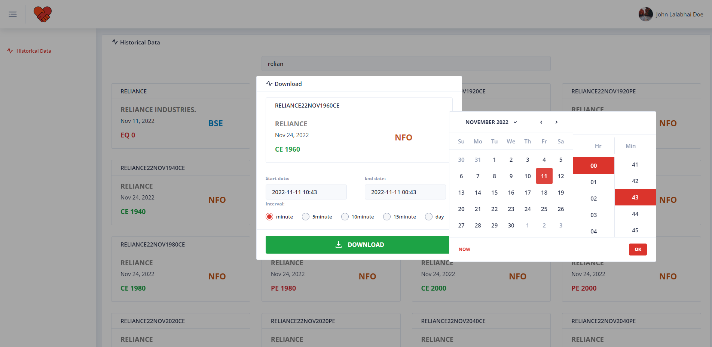

<p align="center">
  
</p>
<br>

<h1 align="center">Kite Helper - Download Stock Market Data</h1>

<p align="center">
  <strong>Indian Stock Market in CSV</strong>
</p>

[](https://hub.docker.com/r/pishangujeniya/kite-helper)
[](https://github.com/pishangujeniya/kite-helper/issues?q=is%3Aopen+is%3Aissue)
[](https://github.com/pishangujeniya/kite-helper/issues?q=is%3Aissue+is%3Aclosed)
[](https://github.com/pishangujeniya/kite-helper/commits/main)
[](https://github.com/pishangujeniya/kite-helper/commits/main)
[](https://github.com/pishangujeniya/kite-helper/blob/main/LICENSE)


Simple Web Application to download Indian stock market data in `.csv` format using Kite

## 😍 Features

- **simple & easy** Run the docker image, that's it.
- **purely local** Everything is in `your control`.
- **privacy:** we don't know your credentials, its everything in your environment 🙈.
- **no ads** strictly no `advertisements & spams`
- **open source** source code is visible to all. Nothing is hidden.
- **clean:** no `extra` bullshit!

## 📷 Screenshots




## 💻 Getting Started

```
docker run -p 8080:80 -d pishangujeniya/kite-helper
```

## ⚠️ Warning
- The project or the creator is in any ways not reponsibile for any of your actions. Do at your own risk.
- For education purpose only.
- We do not collect any data or information.
- We do not have any connection to the user who is using this.
- The code of project is totally opensource and is very simple and easy to understand which can confirm the above statements.
- If you are happy to use this project and found this project helpful for you as well as others or you learned something from the source code of this project and want to thank me, 
- Be a [Stargazer](https://github.com/pishangujeniya/kite-helper) to this repository.
- Share with your friends and colleagues.
- Follow and Endorse me on [linkedin](https://www.linkedin.com/in/pishangujeniya).

## 💰 Donations
- *Star it!* ⭐
- [PayPal](https://paypal.me/Pishang)

<a href="https://paypal.me/Pishang"></a>
